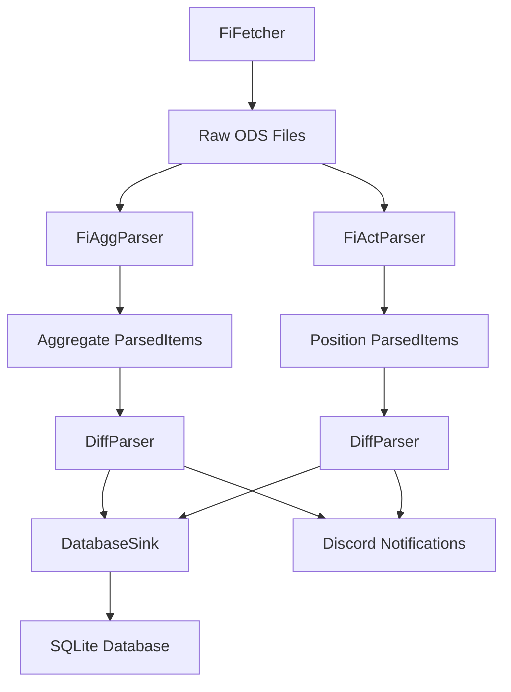

# Modular Scraper Platform

A plugin-centric framework for building data processing pipelines with automatic plugin discovery and YAML-based configuration. Features a Transform-based architecture where plugins can be chained together without manual registration.

## Architecture

```
modular-scraping-platform/
│
├── core/                           # Core framework
│   ├── interfaces.py              # Transform interface + legacy abstractions
│   ├── models.py                  # RawItem, ParsedItem, Event models
│   ├── plugin_loader.py           # Automatic plugin discovery system
│   ├── pipeline_orchestrator.py   # Pipeline execution engine with context management
│   └── infra/                     # Infrastructure components
│       ├── http.py               # aiohttp wrapper with exponential backoff retry
│       ├── ws.py                 # WebSocket client with heartbeat / reconnect
│       ├── sel.py                # Playwright helpers for browser automation
│       ├── db.py                 # Async SQLite wrapper with migrations & WAL mode
│       └── scheduler.py          # APScheduler wrapper for cron scheduling
│
├── plugins/                        # Auto-discovered plugins (zero registration)
│   └── fi_shortinterest/          # Example: FI Short Interest plugin
│       ├── fetcher.py             # FiFetcher (data fetching transform)
│       ├── parser.py              # FiAggParser / FiActParser (parsing transforms)
│       ├── diff_parser.py         # DiffParser (change detection transform)
│       ├── sinks.py               # DatabaseSink (storage transform)
│       └── __init__.py            # Plugin exports
│
├── pipelines.yml                   # Declarative pipeline configuration
├── main.py                         # Pipeline entry point
└── misc/
    ├── spec.md                    # Technical specification
    └── integration_bridge.py      # Bridge for existing Discord bot
```

## Key Features

- **Zero-Registration Plugin System**: Drop plugin folders in `plugins/` directory - automatic discovery on startup
- **Dual Interface Architecture**: All components implement both legacy interfaces (Fetcher/Parser/Sink) AND Transform interface
- **Transform-Based Pipeline**: Universal `async def __call__(items: AsyncIterator[Any]) -> AsyncIterator[Any]` interface enables seamless chaining
- **YAML Configuration**: Declarative pipeline definition with no code changes required
- **Async Streaming**: Backpressure-aware processing with async iterators and context management
- **Change Detection**: Built-in diff detection against database state (DiffParser)
- **Robust Infrastructure**: HTTP retry with exponential backoff, database migrations, WebSocket auto-reconnect
- **Resource Management**: Automatic cleanup via async context managers (`__aenter__`/`__aexit__`)
- **Type Safety**: Pydantic models throughout with datetime defaults and validation

## Quick Start

### Standalone Usage

```bash
cd modular-scraping-platform
pip install -r requirements.txt
python main.py
```

The system will automatically discover plugins and run the pipelines defined in `pipelines.yml`.

### Example Pipeline Configuration

```yaml
pipelines:
  # FI Short Interest - Aggregate data pipeline with diff detection
  fi_shortinterest_agg:
    chain:
      - class: fi_shortinterest.FiFetcher    # Fetches ODS files from Finansinspektionen
        kwargs: {}
      - class: fi_shortinterest.FiAggParser  # Parses aggregate short interest data
        kwargs: {}
      - class: fi_shortinterest.DiffParser   # Detects changes vs previous state
        kwargs:
          db_path: "fi_shortinterest.db"
      - class: fi_shortinterest.DatabaseSink # Persists to SQLite with upsert
        kwargs:
          db_path: "fi_shortinterest.db"

  # FI Short Interest - Position data pipeline
  fi_shortinterest_pos:
    chain:
      - class: fi_shortinterest.FiFetcher
        kwargs: {}
      - class: fi_shortinterest.FiActParser  # Parses individual position data
        kwargs: {}
      - class: fi_shortinterest.DiffParser
        kwargs:
          db_path: "fi_shortinterest.db"
      - class: fi_shortinterest.DatabaseSink
        kwargs:
          db_path: "fi_shortinterest.db"
```

### Integration with Existing Discord Bot

```python
from misc.integration_bridge import start_fi_monitoring

# In your Discord bot setup
bridge = await start_fi_monitoring(
    discord_bot=bot,
    session=your_aiohttp_session,  # optional
    channel_id=1175019650963222599,
    error_channel_id=1162053416290361516,
)

# The system now runs continuously in the background
# Automatic change detection and Discord notifications
```

## Configuration

Edit `pipelines.yml` to define your data processing pipelines. Each pipeline is a sequence of Transform classes that are chained together:

```yaml
pipelines:
  my_pipeline_name:
    chain:
      - class: "my_plugin.DataFetcher"     # Fetches data from source
        kwargs:
          api_key: "your-api-key"
          base_url: "https://api.example.com"
      - class: "my_plugin.DataParser"      # Parses raw data into structured format
        kwargs: {}
      - class: "my_plugin.DiffParser"      # Detects changes vs database (optional)
        kwargs:
          db_path: "my_data.db"
      - class: "my_plugin.DatabaseSink"    # Persists to database
        kwargs:
          db_path: "my_data.db"
```

### Transform Interface

All pipeline stages implement the Transform interface:

```python
from core.interfaces import Transform
from typing import AsyncIterator, Any

class MyTransform(Transform):
    async def __call__(self, items: AsyncIterator[Any]) -> AsyncIterator[Any]:
        async for item in items:
            # Process the item
            processed_item = self.process(item)
            yield processed_item
```

## Database Schema

The system automatically creates and migrates SQLite tables based on the ParsedItem topics:

### FI Short Interest Tables

- **`short_positions`**: Aggregate short interest data
  - `lei` (Primary Key): Legal Entity Identifier
  - `company_name`: Company name
  - `position_percent`: Short position percentage
  - `latest_position_date`: Date of latest position
  - `timestamp`: When data was fetched

- **`position_holders`**: Individual position holder data
  - `entity_name`, `issuer_name`, `isin` (Composite Primary Key)
  - `position_percent`: Position percentage
  - `position_date`: Date of position
  - `comment`: Additional comments
  - `timestamp`: When data was fetched

- **`short_positions_history`**: Historical changes in aggregate data
  - `lei`, `event_timestamp` (Composite Primary Key)
  - All fields from `short_positions` plus:
  - `old_pct`: Previous percentage
  - `new_pct`: New percentage

- **`position_holders_history`**: Historical changes in position data
  - `entity_name`, `issuer_name`, `isin`, `event_timestamp` (Composite Primary Key)
  - All fields from `position_holders` plus:
  - `old_pct`: Previous percentage
  - `new_pct`: New percentage

- **`migrations`**: Schema version tracking

## Adding New Data Sources

1. **Create a plugin directory** under `plugins/your_plugin_name/`

2. **Implement Transform classes** that inherit from both legacy and Transform interfaces:
   ```python
   from core.interfaces import Fetcher, Parser, Sink, Transform
   from core.models import RawItem, ParsedItem
   from typing import AsyncIterator, Any, List
   
   class MyFetcher(Fetcher, Transform):
       name = "MyFetcher"
       
       async def fetch(self) -> AsyncIterator[RawItem]:
           # Legacy interface: your fetching logic here
           yield RawItem(source="my.source", payload=b"data", fetched_at=datetime.utcnow())
       
       async def __call__(self, items: AsyncIterator[Any]) -> AsyncIterator[RawItem]:
           # Transform interface: ignore input and yield fetched items
           async for item in items:
               async for raw_item in self.fetch():
                   yield raw_item
               break  # Only process one input to trigger fetching

   class MyParser(Parser, Transform):
       name = "MyParser"
       
       async def parse(self, item: RawItem) -> List[ParsedItem]:
           # Legacy interface: parse raw data
           return [ParsedItem(topic="my.topic", content={"key": "value"})]
       
       async def __call__(self, items: AsyncIterator[Any]) -> AsyncIterator[ParsedItem]:
           # Transform interface: parse items
           async for item in items:
               if isinstance(item, RawItem):
                   parsed_items = await self.parse(item)
                   for parsed in parsed_items:
                       yield parsed

   class MySink(Sink, Transform):
       name = "MySink"
       
       async def handle(self, item: ParsedItem) -> None:
           # Legacy interface: handle parsed item
           print(f"Received: {item.topic}")
       
       async def __call__(self, items: AsyncIterator[Any]) -> AsyncIterator[None]:
           # Transform interface: handle items
           async for item in items:
               if isinstance(item, ParsedItem):
                   await self.handle(item)
               yield None  # Sinks complete the chain
   ```

3. **Add plugin exports** in `plugins/your_plugin_name/__init__.py`:
   ```python
   from .fetcher import MyFetcher
   from .parser import MyParser
   from .sinks import MySink
   
   __all__ = ["MyFetcher", "MyParser", "MySink"]
   ```

4. **Add to pipeline configuration** in `pipelines.yml`:
   ```yaml
   pipelines:
     my_data_source:
       chain:
         - class: "your_plugin_name.MyFetcher"
           kwargs: {}
         - class: "your_plugin_name.MyParser"
           kwargs: {}
         - class: "your_plugin_name.MySink"
           kwargs: {}
   ```

5. **Run the system** - plugins are auto-discovered on startup!

## Development

### Setup

```bash
# Clone the repository
git clone <repository-url>
cd modular-scraping-platform

# Install dependencies
pip install -r requirements.txt

# Run the system
python main.py
```

### Creating New Plugins

1. Create directory structure: `plugins/your_plugin_name/`
2. Implement classes inheriting from both legacy and Transform interfaces
3. Add exports to `__init__.py`
4. Configure pipeline in `pipelines.yml`
5. Test with `python main.py`

### Code Quality

```bash
# Format code
black .
isort .

# Type checking
mypy .

# Run tests (if available)
pytest
```

### Debugging

- Set logging level to DEBUG in main.py
- Check database contents: `sqlite3 your_db.db`
- Monitor pipeline execution with timestamps in logs
- Use async debugger-friendly tools

### Performance Considerations

- **Memory**: Async iterators process items one at a time
- **Database**: SQLite WAL mode enables concurrent reads
- **HTTP**: Exponential backoff prevents overwhelming target APIs
- **CPU**: Pandas operations are the main computational bottleneck

## Migration from Old System

The `misc/integration_bridge.py` provides a drop-in replacement for the old system. The new architecture offers:

- **Zero Registration**: Plugins are auto-discovered from `plugins/` directory
- **Dual Interface Support**: Legacy interfaces (Fetcher/Parser/Sink) work alongside Transform interface
- **Declarative Configuration**: Pipeline chains defined in YAML without code changes
- **Transform Pattern**: Universal `async __call__` interface for all components  
- **Streaming Processing**: Async iterators enable backpressure and efficient memory usage
- **Change Detection**: Built-in diff detection with DiffParser for monitoring changes
- **Resource Management**: Automatic cleanup via async context managers
- **Hot-Swappable**: Drop new plugins in `plugins/` directory and restart

### Migration Strategy

1. **Keep existing code**: Legacy interfaces still work
2. **Add Transform interface**: Implement `__call__` method as wrapper around legacy methods
3. **Move to plugins directory**: Organize code in `plugins/your_plugin/` structure
4. **Create YAML config**: Define pipelines declaratively
5. **Add resource management**: Implement `__aenter__`/`__aexit__` for cleanup (optional)
6. **Test side-by-side**: Run old and new systems in parallel until parity achieved

## Real-World Example: FI Short Interest Plugin

The repository includes a fully functional plugin that monitors Swedish short interest data from Finansinspektionen (FI):

### What it does

1. **Fetches** ODS (OpenDocument Spreadsheet) files from FI's website
2. **Parses** both aggregate short interest data and individual position data  
3. **Detects changes** by comparing against previous database state
4. **Persists** data to SQLite with automatic schema management
5. **Provides** integration hooks for Discord notifications

### Plugin Structure

```
plugins/fi_shortinterest/
├── __init__.py           # Plugin exports
├── fetcher.py           # FiFetcher - polls FI website for timestamp changes
├── parser.py            # FiAggParser, FiActParser - parse ODS files
├── diff_parser.py       # DiffParser - detects changes vs database
└── sinks.py             # DatabaseSink - persists to SQLite
```

### How it works

**Fetching**: Polls FI website every run, checks for timestamp changes, downloads new ODS files only when needed.

**Parsing**: Uses pandas to parse ODS files, handles column mapping and data cleaning.

**Change Detection**: Compares new data against database, emits diff events only when positions change by >0.001%.

**Storage**: Uses SQLite with WAL mode, automatic migrations, and upsert operations for data persistence.

### Data Flow



### Running the Example

```bash
# Install dependencies
pip install -r requirements.txt

# Run the pipeline
python main.py

# Check the generated database
sqlite3 fi_shortinterest.db
.tables
.schema short_positions
```

The system will:
- Auto-discover the FI plugin from `plugins/fi_shortinterest/`
- Load pipeline configuration from `pipelines.yml`
- Execute both aggregate and position pipelines
- Create and populate `fi_shortinterest.db` with current data
- Log all operations with timestamps and status

### Technical Details

**Error Handling**: Robust retry logic with exponential backoff for HTTP requests.

**Concurrency**: Async throughout, supports running multiple pipelines simultaneously.

**Memory Efficiency**: Streaming processing with async iterators - processes items one at a time rather than loading everything into memory.

**Database**: Uses SQLite with WAL (Write-Ahead Logging) mode for better concurrency, automatic schema migrations.

**Monitoring**: Comprehensive logging at INFO level for monitoring data flow and changes.