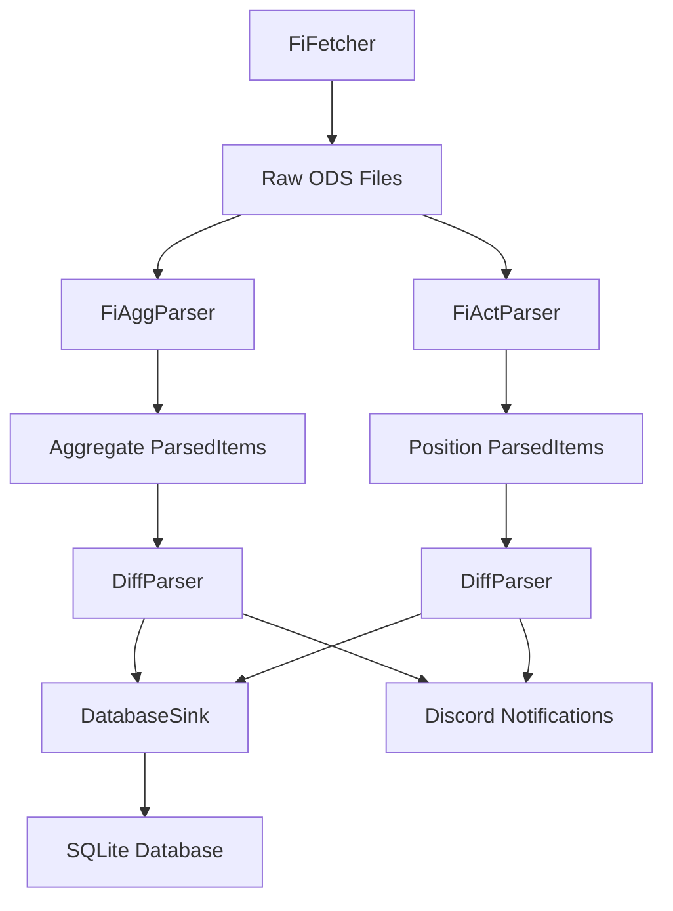
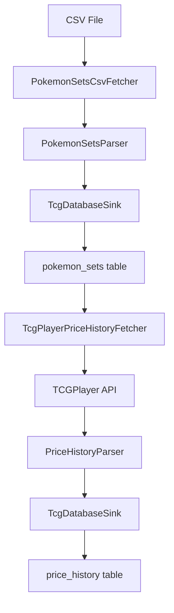

# Modular Scraper Platform

A plugin-centric framework for building data processing pipelines with automatic plugin discovery and YAML-based configuration. Features a Transform-based architecture where plugins can be chained together without manual registration.

## Architecture

```
modular-scraping-platform/
│
├── core/                           # Core framework
│   ├── interfaces.py              # Transform interface with Fetcher/Sink specializations
│   ├── models.py                  # RawItem, ParsedItem, Event models
│   ├── plugin_loader.py           # Automatic plugin discovery system
│   ├── pipeline_orchestrator.py   # Pipeline execution engine with context management
│   └── infra/                     # Infrastructure components
│       ├── http.py               # Advanced HTTP client with retry logic & jitter
│       ├── ws.py                 # WebSocket client with heartbeat / reconnect
│       ├── sel.py                # Playwright client with stealth mode & utilities
│       ├── db.py                 # Async SQLite wrapper with migrations & WAL mode
│       └── scheduler.py          # APScheduler wrapper for cron scheduling
│
├── plugins/                        # Auto-discovered plugins (zero registration)
│   └── fi_shortinterest/          # Example: FI Short Interest plugin
│       ├── fetcher.py             # FiFetcher (Fetcher specialization)
│       ├── parser.py              # FiAggParser / FiActParser (Transform implementations)
│       ├── diff_parser.py         # DiffParser (Transform implementation)
│       ├── sinks.py               # DatabaseSink (Sink specialization)
│       └── __init__.py            # Plugin exports
│
├── pipelines.yml                   # Declarative pipeline configuration
├── main.py                         # Pipeline entry point
└── misc/
    ├── spec.md                    # Technical specification
    └── integration_bridge.py      # Bridge for existing Discord bot
```

## Key Features

- **Zero-Registration Plugin System**: Drop plugin folders in `plugins/` directory - automatic discovery on startup
- **Clean Transform Architecture**: All components inherit from Transform base class with Fetcher/Sink specializations
- **Transform-Based Pipeline**: Universal `async def __call__(items: AsyncIterator[Any]) -> AsyncIterator[Any]` interface enables seamless chaining
- **YAML Configuration**: Declarative pipeline definition with no code changes required
- **Async Streaming**: Backpressure-aware processing with async iterators and context management
- **Change Detection**: Built-in diff detection against database state (DiffParser)
- **Robust Infrastructure**: Advanced HTTP retry with jitter, Playwright stealth mode, database migrations, WebSocket auto-reconnect
- **Resource Management**: Automatic cleanup via async context managers (`__aenter__`/`__aexit__`)
- **Type Safety**: Pydantic models throughout with datetime defaults and validation

## Infrastructure Components

The framework provides battle-tested infrastructure modules that handle common scraping challenges:

### HttpClient (`core/infra/http.py`)
Advanced HTTP client built on aiohttp with production-ready features:
- **Smart Retry Logic**: Exponential backoff with jitter for 429/5xx status codes
- **Retry-After Support**: Automatically parses and respects HTTP `Retry-After` headers
- **Session Management**: Automatic session lifecycle with connection pooling
- **Default Headers**: Per-instance headers (User-Agent, etc.) with merge capabilities
- **Convenience Methods**: `get_text()`, `get_json()`, `get_bytes()`, `post_json()`

```python
from core.infra.http import HttpClient

async with HttpClient(max_retries=5, base_delay=2.0) as client:
    data = await client.get_json("https://api.example.com/data")
```

### PlaywrightClient (`core/infra/sel.py`)
Full-featured browser automation with anti-detection capabilities:
- **Stealth Mode**: Random User-Agent, navigator.webdriver removal, plugin spoofing
- **Cookie Utilities**: `dismiss_cookies()` with fallback selector support
- **Infinite Scroll**: `scroll_to_bottom()` for lazy-loading pages
- **Click Utilities**: `click_repeatedly()` for "Load More" buttons
- **Shadow DOM**: Built-in shadow DOM content extraction
- **Context Management**: Automatic browser/context cleanup

```python
from core.infra.sel import PlaywrightClient

async with PlaywrightClient(stealth=True) as pw:
    page = await pw.new_page()
    html = await pw.get_page_content("https://spa-app.com", wait_for_selector=".content")
```

### Database (`core/infra/db.py`)
Async SQLite wrapper with production features:
- **WAL Mode**: Concurrent read access for better performance  
- **Auto-Migration**: Schema versioning and automatic table creation
- **Upsert Operations**: Conflict-aware inserts for data deduplication
- **Connection Pooling**: Efficient resource management

## Quick Start

### Standalone Usage

```bash
cd modular-scraping-platform
pip install -r requirements.txt
python main.py
```

The system will automatically discover plugins and run the pipelines defined in `pipelines.yml`.

### Example Pipeline Configuration

```yaml
pipelines:
  # FI Short Interest - Aggregate data pipeline with diff detection
  fi_shortinterest_agg:
    chain:
      - class: fi_shortinterest.FiFetcher    # Fetches ODS files from Finansinspektionen
        kwargs: {}
      - class: fi_shortinterest.FiAggParser  # Parses aggregate short interest data
        kwargs: {}
      - class: fi_shortinterest.DiffParser   # Detects changes vs previous state
        kwargs:
          db_path: "fi_shortinterest.db"
      - class: fi_shortinterest.DatabaseSink # Persists to SQLite with upsert
        kwargs:
          db_path: "fi_shortinterest.db"

  # FI Short Interest - Position data pipeline
  fi_shortinterest_pos:
    chain:
      - class: fi_shortinterest.FiFetcher
        kwargs: {}
      - class: fi_shortinterest.FiActParser  # Parses individual position data
        kwargs: {}
      - class: fi_shortinterest.DiffParser
        kwargs:
          db_path: "fi_shortinterest.db"
      - class: fi_shortinterest.DatabaseSink
        kwargs:
          db_path: "fi_shortinterest.db"
```

### Integration with Existing Discord Bot

```python
from misc.integration_bridge import start_fi_monitoring

# In your Discord bot setup
bridge = await start_fi_monitoring(
    discord_bot=bot,
    session=your_aiohttp_session,  # optional
    channel_id=1175019650963222599,
    error_channel_id=1162053416290361516,
)

# The system now runs continuously in the background
# Automatic change detection and Discord notifications
```

## Configuration

Edit `pipelines.yml` to define your data processing pipelines. Each pipeline is a sequence of Transform classes that are chained together:

```yaml
pipelines:
  my_pipeline_name:
    chain:
      - class: "my_plugin.DataFetcher"     # Fetches data from source
        kwargs:
          api_key: "your-api-key"
          base_url: "https://api.example.com"
      - class: "my_plugin.DataParser"      # Parses raw data into structured format
        kwargs: {}
      - class: "my_plugin.DiffParser"      # Detects changes vs database (optional)
        kwargs:
          db_path: "my_data.db"
      - class: "my_plugin.DatabaseSink"    # Persists to database
        kwargs:
          db_path: "my_data.db"
```

### Transform Interface

All pipeline stages implement the Transform interface:

```python
from core.interfaces import Transform
from typing import AsyncIterator, Any

class MyTransform(Transform):
    async def __call__(self, items: AsyncIterator[Any]) -> AsyncIterator[Any]:
        async for item in items:
            # Process the item
            processed_item = self.process(item)
            yield processed_item
```

## Database Schema

The system automatically creates and migrates SQLite tables based on the ParsedItem topics:

### FI Short Interest Tables

- **`short_positions`**: Aggregate short interest data
  - `lei` (Primary Key): Legal Entity Identifier
  - `company_name`: Company name
  - `position_percent`: Short position percentage
  - `latest_position_date`: Date of latest position
  - `timestamp`: When data was fetched

- **`position_holders`**: Individual position holder data
  - `entity_name`, `issuer_name`, `isin` (Composite Primary Key)
  - `position_percent`: Position percentage
  - `position_date`: Date of position
  - `comment`: Additional comments
  - `timestamp`: When data was fetched

- **`short_positions_history`**: Historical changes in aggregate data
  - `lei`, `event_timestamp` (Composite Primary Key)
  - All fields from `short_positions` plus:
  - `old_pct`: Previous percentage
  - `new_pct`: New percentage

- **`position_holders_history`**: Historical changes in position data
  - `entity_name`, `issuer_name`, `isin`, `event_timestamp` (Composite Primary Key)
  - All fields from `position_holders` plus:
  - `old_pct`: Previous percentage
  - `new_pct`: New percentage

- **`migrations`**: Schema version tracking

## Adding New Data Sources

1. **Create a plugin directory** under `plugins/your_plugin_name/`

2. **Implement Transform classes** that inherit from the appropriate base classes:
   ```python
   from core.interfaces import Fetcher, Sink, Transform
   from core.models import RawItem, ParsedItem
   from core.infra.http import HttpClient
   from core.infra.sel import PlaywrightClient
   from typing import AsyncIterator, Any, List
   from datetime import datetime
   
   class MyFetcher(Fetcher):
       name = "MyFetcher"
       
       def __init__(self, *, use_browser: bool = False):
           self.use_browser = use_browser
           self.http_client = HttpClient(max_retries=3)
           self.browser_client = PlaywrightClient(stealth=True) if use_browser else None
       
       async def fetch(self) -> AsyncIterator[RawItem]:
           # HTTP fetching with automatic retry
           if not self.use_browser:
               async with self.http_client as client:
                   data = await client.get_json("https://api.example.com/data")
                   yield RawItem(source="api.data", payload=str(data).encode(), fetched_at=datetime.utcnow())
           
           # Browser automation for SPAs
           else:
               async with self.browser_client as browser:
                   html = await browser.get_page_content("https://spa.example.com", wait_for_selector=".content")
                   yield RawItem(source="spa.html", payload=html.encode(), fetched_at=datetime.utcnow())
       
       # __call__ method provided by Fetcher base class

   class MyDataProcessor(Transform):
       name = "MyDataProcessor"
       
       async def __call__(self, items: AsyncIterator[Any]) -> AsyncIterator[ParsedItem]:
           # Transform interface: process items
           async for item in items:
               if isinstance(item, RawItem):
                   # Process your data
                   yield ParsedItem(topic="my.topic", content={"key": "value"})

   class MySink(Sink):
       name = "MySink"
       
       async def handle(self, item: ParsedItem) -> None:
           # Handle parsed item
           print(f"Received: {item.topic}")
       
       # __call__ method provided by Sink base class
   ```

3. **Add plugin exports** in `plugins/your_plugin_name/__init__.py`:
   ```python
   from .fetcher import MyFetcher
   from .processors import MyDataProcessor
   from .sinks import MySink
   
   __all__ = ["MyFetcher", "MyDataProcessor", "MySink"]
   ```

4. **Add to pipeline configuration** in `pipelines.yml`:
   ```yaml
   pipelines:
     my_data_source:
       chain:
         - class: "your_plugin_name.MyFetcher"
           kwargs: {}
         - class: "your_plugin_name.MyDataProcessor"
           kwargs: {}
         - class: "your_plugin_name.MySink"
           kwargs: {}
   ```

5. **Run the system** - plugins are auto-discovered on startup!

## Development

### Setup

```bash
# Clone the repository
git clone <repository-url>
cd modular-scraping-platform

# Install dependencies
pip install -r requirements.txt

# Run the system
python main.py
```

### Creating New Plugins

1. Create directory structure: `plugins/your_plugin_name/`
2. Implement classes inheriting from Transform, Fetcher, or Sink as appropriate
3. Add exports to `__init__.py`
4. Configure pipeline in `pipelines.yml`
5. Test with `python main.py`

### Code Quality

```bash
# Format code
black .
isort .

# Type checking
mypy .

# Run tests (if available)
pytest
```

### Debugging

- Set logging level to DEBUG in main.py
- Check database contents: `sqlite3 your_db.db`
- Monitor pipeline execution with timestamps in logs
- Use async debugger-friendly tools

### Performance Considerations

- **Memory**: Async iterators process items one at a time
- **Database**: SQLite WAL mode enables concurrent reads
- **HTTP**: Advanced exponential backoff with jitter prevents overwhelming target APIs, Retry-After header support minimizes unnecessary delays
- **Browser Automation**: Stealth mode reduces detection risks, infinite scroll utilities handle complex SPAs efficiently
- **CPU**: Pandas operations are the main computational bottleneck

## Migration from Old System

The `misc/integration_bridge.py` provides a drop-in replacement for the old system. The new architecture offers:

- **Zero Registration**: Plugins are auto-discovered from `plugins/` directory
- **Clean Transform Architecture**: Single inheritance hierarchy with Transform as base class
- **Declarative Configuration**: Pipeline chains defined in YAML without code changes
- **Transform Pattern**: Universal `async __call__` interface for all components  
- **Streaming Processing**: Async iterators enable backpressure and efficient memory usage
- **Change Detection**: Built-in diff detection with DiffParser for monitoring changes
- **Resource Management**: Automatic cleanup via async context managers
- **Hot-Swappable**: Drop new plugins in `plugins/` directory and restart

### Migration Strategy

1. **Update inheritance**: Change from multiple inheritance to single inheritance from Transform/Fetcher/Sink
2. **Implement Transform interface**: Ensure all classes have proper `__call__` method
3. **Move to plugins directory**: Organize code in `plugins/your_plugin/` structure
4. **Create YAML config**: Define pipelines declaratively
5. **Add resource management**: Implement `__aenter__`/`__aexit__` for cleanup (optional)
6. **Test side-by-side**: Run old and new systems in parallel until parity achieved

## Real-World Example: FI Short Interest Plugin

The repository includes a fully functional plugin that monitors Swedish short interest data from Finansinspektionen (FI):

### What it does

1. **Fetches** ODS (OpenDocument Spreadsheet) files from FI's website
2. **Parses** both aggregate short interest data and individual position data  
3. **Detects changes** by comparing against previous database state
4. **Persists** data to SQLite with automatic schema management
5. **Provides** integration hooks for Discord notifications

### Plugin Structure

```
plugins/fi_shortinterest/
├── __init__.py           # Plugin exports
├── fetcher.py           # FiFetcher - polls FI website for timestamp changes
├── parser.py            # FiAggParser, FiActParser - parse ODS files
├── diff_parser.py       # DiffParser - detects changes vs database
└── sinks.py             # DatabaseSink - persists to SQLite
```

### How it works

**Fetching**: Polls FI website every run, checks for timestamp changes, downloads new ODS files only when needed.

**Parsing**: Uses pandas to parse ODS files, handles column mapping and data cleaning.

**Change Detection**: Compares new data against database, emits diff events only when positions change by >0.001%.

**Storage**: Uses SQLite with WAL mode, automatic migrations, and upsert operations for data persistence.

### Data Flow



### Running the Example

```bash
# Install dependencies
pip install -r requirements.txt

# Run the pipeline
python main.py

# Check the generated database
sqlite3 fi_shortinterest.db
.tables
.schema short_positions
```

The system will:
- Auto-discover the FI plugin from `plugins/fi_shortinterest/`
- Load pipeline configuration from `pipelines.yml`
- Execute both aggregate and position pipelines
- Create and populate `fi_shortinterest.db` with current data
- Log all operations with timestamps and status

### Technical Details

**Error Handling**: Robust retry logic with exponential backoff for HTTP requests.

**Concurrency**: Async throughout, supports running multiple pipelines simultaneously.

**Memory Efficiency**: Streaming processing with async iterators - processes items one at a time rather than loading everything into memory.

**Database**: Uses SQLite with WAL (Write-Ahead Logging) mode for better concurrency, automatic schema migrations.

**Monitoring**: Comprehensive logging at INFO level for monitoring data flow and changes.

## Real-World Example: TCGPlayer Plugin

The repository includes a second fully functional plugin that demonstrates API-driven data collection with database-driven fetching for Pokemon card pricing data from TCGPlayer:

### What it does

1. **Imports** Pokemon set reference data from CSV files with proper BOM handling
2. **Fetches** price history from TCGPlayer API using product IDs from the database
3. **Parses** complex JSON API responses with nested data structures
4. **Persists** comprehensive pricing data with proper schema management
5. **Demonstrates** database-driven pipeline architecture

### Plugin Structure

```
plugins/tcgplayer/
├── __init__.py           # Plugin exports  
├── fetchers.py          # PokemonSetsCsvFetcher, TcgPlayerPriceHistoryFetcher
├── parsers.py           # PokemonSetsParser, PriceHistoryParser  
└── sinks.py             # TcgDatabaseSink - handles multiple table schemas
```

### How it works

**CSV Import**: Reads Pokemon set data from semicolon-delimited CSV files, handles Unicode BOM, extracts product IDs.

**Database-Driven API Calls**: Queries database for product IDs, then fetches price history from TCGPlayer API for each product.

**Complex JSON Parsing**: Handles nested API responses with multiple SKUs and historical price buckets per product.

**Multi-Table Persistence**: Manages separate schemas for Pokemon sets and price history data with proper relationships.

### Pipeline Configuration

```yaml
pipelines:
  # Pokemon Sets - CSV import pipeline
  tcgplayer_pokemon_sets:
    chain:
      - class: tcgplayer.PokemonSetsCsvFetcher    # Reads CSV files with BOM handling
        kwargs:
          file_path: "development/tcg/pokemon_sets.csv"
      - class: tcgplayer.PokemonSetsParser        # Parses semicolon-delimited CSV
        kwargs: {}
      - class: tcgplayer.TcgDatabaseSink          # Persists to pokemon_sets table
        kwargs:
          db_path: "tcg.db"

  # Price History - API-driven pipeline using database product IDs
  tcgplayer_price_history:
    chain:
      - class: tcgplayer.TcgPlayerPriceHistoryFetcher  # Reads product IDs from DB
        kwargs:
          db_path: "tcg.db"
          api_key: "your-tcgplayer-api-key"
      - class: tcgplayer.PriceHistoryParser             # Parses JSON API responses  
        kwargs: {}
      - class: tcgplayer.TcgDatabaseSink                # Persists to price_history table
        kwargs:
          db_path: "tcg.db"
```

### Data Flow



### Database Schema

**`pokemon_sets`**: Reference data for Pokemon sets
- `set_name` (Primary Key): Pokemon set name
- `release_date`: Set release date  
- `booster_product_id`: TCGPlayer booster product ID
- `booster_box_product_id`: TCGPlayer booster box product ID
- `group_id`: TCGPlayer group ID
- `created_at`, `updated_at`: Timestamps

**`price_history`**: Historical pricing data
- `sku_id`, `bucket_start_date` (Composite Primary Key)  
- `product_id`: Reference to TCGPlayer product
- `variant`, `language`, `condition`: Product variant details
- `market_price`: Market price for the time period
- `quantity_sold`: Number of units sold
- `low_sale_price`, `high_sale_price`: Price range
- `created_at`, `updated_at`: Timestamps

### Running the TCGPlayer Example

```bash
# Install dependencies
pip install -r requirements.txt

# Run Pokemon sets import pipeline
python run_pipeline.py tcg_test.yml tcgplayer_pokemon_sets

# Run price history pipeline (requires API key)
python run_pipeline.py tcg_test.yml tcgplayer_price_history

# Check the generated database  
sqlite3 tcg.db
.tables
SELECT COUNT(*) FROM pokemon_sets;
SELECT COUNT(*) FROM price_history;
```

### Results

The TCGPlayer plugin successfully demonstrates:
- **CSV Processing**: Imported 20 Pokemon sets with 40 unique product IDs
- **API Integration**: Fetched 2,080+ price history records (52 records per product)
- **Database Relationships**: Used pokemon_sets data to drive price_history API calls
- **Data Quality**: Historical price data showing market trends over time
- **Schema Management**: Automatic table creation and column management

### Key Features Demonstrated

**BOM Handling**: Proper Unicode handling for CSV files with `decode('utf-8-sig')`

**Database-Driven Fetching**: SQL queries to get product IDs dynamically rather than hardcoded values

**Complex API Parsing**: Nested JSON structure with `result` arrays containing `buckets` of historical data

**Multi-Table Sinks**: Single sink class managing different table schemas based on ParsedItem topics

**Error Resilience**: Graceful handling of API rate limits and malformed data

### Technical Highlights

**Memory Efficiency**: Processes one product at a time rather than loading all data into memory

**API Rate Limiting**: Respects TCGPlayer API limits with proper error handling

**Data Validation**: Type conversion and null handling for robust data quality

**Schema Evolution**: Automatic column addition (e.g., `updated_at` column) for schema changes

This plugin showcases how the framework handles real-world complexity including API integration, database relationships, and multi-stage data processing pipelines.

## Best Practices

When developing plugins, follow these patterns for optimal reliability:

#### HTTP Client Usage
```python
# Good: Configure retry settings based on target API characteristics
self.http = HttpClient(
    max_retries=6,                    # API-dependent: more for flaky services
    base_delay=2.0,                   # Start conservative to avoid overwhelming
    default_headers={"User-Agent": "YourBot/1.0"}  # Always identify your bot
)

# Good: Use appropriate method for data type
text_data = await client.get_text(url)          # For HTML/XML
json_data = await client.get_json(url)          # For APIs
binary_data = await client.get_bytes(url)       # For files/images
```

#### Browser Automation
```python
# Good: Enable stealth mode for detection-sensitive sites
browser = PlaywrightClient(stealth=True, timeout=30_000)

# Good: Use utility functions for common patterns
await dismiss_cookies(page, [".accept-cookies", "#cookie-ok"])
await scroll_to_bottom(page, max_scrolls=10)

# Good: Always wait for content before extraction
await page.wait_for_selector(".content", timeout=30_000)
html = await page.content()
```

#### Resource Management
```python
# Good: Use async context managers for automatic cleanup
async with HttpClient() as client:
    data = await client.get_json(url)

async with PlaywrightClient() as browser:
    html = await browser.get_page_content(url)

# Good: Implement __aenter__/__aexit__ in custom fetchers
class MyFetcher(Fetcher):
    async def __aenter__(self):
        await self.http_client.__aenter__()
        return self
    
    async def __aexit__(self, exc_type, exc_val, exc_tb):
        await self.http_client.__aexit__(exc_type, exc_val, exc_tb)
```