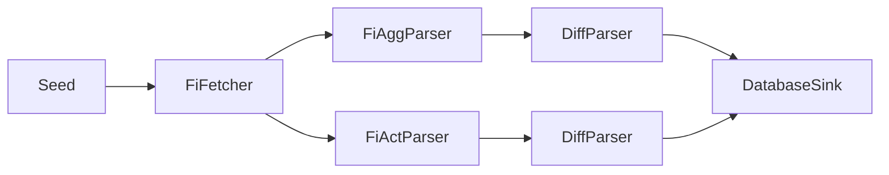

# Modular Scraping Platform - Technical Specification

Below is the technical specification for the modular scraping platform based on the implemented architecture. This document outlines the design principles and patterns used to create a clean, extensible framework.

---

## 1. Identify the stable axis of change

| Axis                | Relatively **stable**                             | Rapidly **changing**                                    |
| ------------------- | ------------------------------------------------- | ------------------------------------------------------- |
| Core behaviours     | *Transform Pipeline Processing*                    | The exact site/API, HTML quirks, payload formats        |
| Cross-cutting infra | Plugin discovery, async streaming, retry logic    | Where a message goes (Discord, DB, file), schema tweaks |
| Deployment          | Docker image, CI job, k8s CronJob, systemd timer  | The number of instances, scrape frequency               |

Design the framework around the **stable axis** (behaviours & infra). Everything that varies sits behind a thin, site-specific adapter.

---

## 2. Define canonical interfaces

The platform uses a **clean Transform-based architecture** with three core components:

```python
from abc import ABC, abstractmethod
from typing import Any, AsyncIterator, Dict, List
from datetime import datetime
from pydantic import BaseModel, Field

class RawItem(BaseModel):
    """Raw data fetched from a source."""
    source: str
    payload: bytes
    fetched_at: datetime = Field(default_factory=datetime.utcnow)

class ParsedItem(BaseModel):
    """Parsed and structured data."""
    topic: str           # e.g. "fi.short.aggregate"
    content: Dict[str, Any]
    discovered_at: datetime = Field(default_factory=datetime.utcnow)

class Event(BaseModel):
    """System events for logging and monitoring."""
    level: str  # INFO, WARNING, ERROR, etc.
    message: str
    source: str
    timestamp: datetime = Field(default_factory=datetime.utcnow)
    metadata: Dict[str, Any] = Field(default_factory=dict)

class Transform(ABC):
    """Universal transform interface for all pipeline stages.
    
    This is the core abstraction that enables plugin chaining.
    All pipeline components (data processors, fetchers, sinks) inherit from this.
    """
    
    @abstractmethod
    async def __call__(
        self, items: AsyncIterator[Any]
    ) -> AsyncIterator[Any]:
        """Transform an async iterator of items to another async iterator."""
        ...

class Fetcher(Transform):
    """Specialized Transform for data fetching.
    
    Fetchers ignore their input stream and yield RawItems from external sources.
    """
    
    @property
    @abstractmethod
    def name(self) -> str:
        pass

    @abstractmethod
    async def fetch(self) -> AsyncIterator[RawItem]:
        """Fetch data from external source."""
        ...

    async def __call__(self, items: AsyncIterator[Any]) -> AsyncIterator[RawItem]:
        """Transform interface: ignore input and yield fetched items."""
        async for _ in items:
            async for raw_item in self.fetch():
                yield raw_item
            break  # Process one input to trigger fetch

class Sink(Transform):
    """Specialized Transform for data persistence/output.
    
    Sinks handle items (usually ParsedItems) and may yield None to complete chains.
    """
    
    @property
    @abstractmethod
    def name(self) -> str:
        pass

    @abstractmethod
    async def handle(self, item: ParsedItem) -> None:
        """Handle/persist a parsed item."""
        ...

    async def __call__(self, items: AsyncIterator[Any]) -> AsyncIterator[None]:
        """Transform interface: handle items and complete the chain."""
        async for item in items:
            if isinstance(item, ParsedItem):
                await self.handle(item)
            yield None  # Sinks complete the pipeline
```

Everything you scrape must be expressible as a Transform chain:



**Key Architecture Benefits**:
- **Single inheritance hierarchy**: All components inherit from `Transform`
- **Built-in chaining**: `Fetcher` and `Sink` provide `__call__` implementations
- **Clean separation**: Fetchers get data, Transforms process data, Sinks persist data
- **No legacy cruft**: Single interface pattern with specialized subclasses

---

## 3. Orchestrator = automatic plugin discovery + YAML config

The pipeline orchestrator provides:

1. **Automatic plugin discovery** from `plugins/` directory
2. **YAML-based configuration** without code changes
3. **Async context management** for resource cleanup
4. **Transform chaining** with backpressure-aware streaming

```python
# Plugin discovery happens automatically
from core.plugin_loader import refresh_registry, get

# Pipeline execution with context management
async def run_pipeline(cfg: Dict[str, Any]) -> None:
    instances: List[Transform] = []
    for entry in cfg["chain"]:
        cls = get(entry["class"])  # e.g., "fi_shortinterest.FiFetcher"
        kwargs = entry.get("kwargs", {})
        instances.append(cls(**kwargs))
    
    # Execute pipeline with automatic resource cleanup
    async with AsyncExitStack() as stack:
        for stage in instances:
            if hasattr(stage, "__aenter__"):
                await stack.enter_async_context(stage)
        
        # Chain stages and drain the pipeline
        await _drain(instances)
```

---

## 4. Configuration over code

```yaml
pipelines:
  fi_shortinterest_agg:
    chain:
      - class: fi_shortinterest.FiFetcher
        kwargs: {}
      - class: fi_shortinterest.FiAggParser
        kwargs: {}
      - class: fi_shortinterest.DiffParser
        kwargs:
          db_path: "db/fi_shortinterest.db"
      - class: fi_shortinterest.DatabaseSink
        kwargs:
          db_path: "db/fi_shortinterest.db"
```

A new source = one YAML stanza + dropping new plugin folder in `plugins/`. Zero code registration required.

---

## 5. Shared infrastructure modules

| Module         | Implementation                                                                          |
| -------------- | --------------------------------------------------------------------------------------- |
| **http.py**    | Advanced aiohttp wrapper with exponential backoff + jitter, Retry-After header parsing, per-instance default headers, configurable timeouts, and transparent 429/5xx retry handling |
| **ws.py**      | WebSocket client with heartbeat, automatic reconnection, and backpressure management   |
| **sel.py**     | Full-featured Playwright wrapper with stealth mode, cookie dismissal utilities, infinite scroll support, shadow DOM extraction, form automation, and async context management |
| **db.py**      | Async SQLite wrapper with migrations, connection pooling, WAL mode, and upsert support |
| **scheduler.py** | APScheduler wrapper for cron-based scheduling (future enhancement)                   |

All plugins import from these; none re-implement them.

**Production Battle-Tested**: These modules power real-world scrapers handling millions of requests across different domains - from financial data APIs to complex SPAs with anti-bot protection. The retry logic alone has saved countless hours of debugging flaky network conditions.

### HttpClient Advanced Features

- **Smart Retry Logic**: Exponential backoff with jitter for 429/5xx status codes
- **Retry-After Support**: Automatically parses and respects HTTP `Retry-After` headers (both seconds and HTTP-date formats)
- **Session Management**: Automatic session lifecycle with external session support
- **Default Headers**: Per-instance default headers with merge capabilities
- **Convenience Methods**: `get_text()`, `get_json()`, `get_bytes()`, `post_json()` with automatic timeout adjustment
- **Context Manager**: Full async context manager support for resource cleanup

### PlaywrightClient Advanced Features

- **Stealth Mode**: Random User-Agent generation, navigator.webdriver removal, plugin/language spoofing
- **Browser Support**: Chromium, Firefox, and WebKit with configurable launch parameters
- **Utility Functions**: 
  - `dismiss_cookies()`: Try multiple selectors to dismiss cookie banners
  - `click_repeatedly()`: Keep clicking elements until they disappear (useful for "Load More" buttons)
  - `scroll_to_bottom()`: Infinite scroll support for lazy-loading pages
- **Shadow DOM**: Built-in shadow DOM content extraction
- **Form Automation**: Complete form filling and submission with navigation waiting
- **Resource Management**: Automatic browser/context cleanup via async context managers
- **Escape Hatches**: `extra_launch_kwargs` and `extra_context_kwargs` for full Playwright API access

---

## 6. Clean Transform Architecture - Single Inheritance Pattern

Example from FI Short Interest plugin:

```python
class FiFetcher(Fetcher):
    """Data fetcher with built-in Transform interface."""
    
    name = "FiFetcher"
    
    async def fetch(self) -> AsyncIterator[RawItem]:
        """Fetch ODS files from Finansinspektionen."""
        # Poll timestamp and download files if changed
        html = await self.http.get_text(self.URL_TS)
        # ... fetch logic
        if ts and ts != self._last_seen:
            agg_bytes = await self.http.get_bytes(self.URL_AGG)
            act_bytes = await self.http.get_bytes(self.URL_ACT)
            yield RawItem(source="fi.short.agg", payload=agg_bytes, fetched_at=now)
            yield RawItem(source="fi.short.act", payload=act_bytes, fetched_at=now)
    
    # __call__ method provided by Fetcher base class

class FiAggParser(Transform):
    """Parse aggregate short interest data."""
    
    name = "FiAggParser"
    
    async def parse(self, item: RawItem) -> List[ParsedItem]:
        """Parse aggregate ODS data."""
        if not item.source.endswith("agg"):
            return []
        
        df = _read_ods(item.payload, self._cols)
        # ... parsing logic
        return [ParsedItem(topic="fi.short.aggregate", content=rec, discovered_at=item.fetched_at)
                for rec in df.to_dict("records")]
    
    async def __call__(self, items: AsyncIterator[Any]) -> AsyncIterator[ParsedItem]:
        """Transform interface: parse RawItems into ParsedItems."""
        async for item in items:
            if isinstance(item, RawItem):
                parsed_items = await self.parse(item)
                for parsed in parsed_items:
                    yield parsed

class DatabaseSink(Sink):
    """Database persistence with built-in Transform interface."""
    
    name = "DatabaseSink"
    
    async def handle(self, item: ParsedItem) -> None:
        """Persist ParsedItem to database."""
        config = self._TABLE_MAP.get(item.topic)
        if config:
            await self.db.upsert(config["table"], item.content, config["pk"])
    
    # __call__ method provided by Sink base class
    
    async def __aenter__(self):
        """Async context manager for resource management."""
        await self.db.connect()
        return self

    async def __aexit__(self, exc_type, exc_val, exc_tb):
        await self.db.close()
```

**Benefits of Single Inheritance**:
- **Clean hierarchy**: `Transform` → `Fetcher`/`Sink` specializations
- **No multiple inheritance**: Eliminates diamond problem and complexity
- **Built-in chaining**: `Fetcher` and `Sink` provide `__call__` implementations
- **Resource management**: Async context managers for proper cleanup

---

## 7. Advanced Features

### Change Detection with DiffParser

```python
class DiffParser(Transform):
    """Compares ParsedItems against database state and emits only changes."""
    
    async def parse(self, item: ParsedItem) -> List[ParsedItem]:
        """Compare against DB and return diff if changed."""
        if item.topic == "fi.short.aggregate":
            # Check database for previous values
            previous = await self.db.fetch_one(
                "SELECT position_percent FROM short_positions WHERE lei = ?",
                (item.content["lei"],)
            )
            
            current_percent = float(item.content["position_percent"])
            if not previous or abs(current_percent - previous["position_percent"]) > 0.001:
                # Emit diff event
                return [ParsedItem(
                    topic="fi.short.aggregate.diff",
                    content={**item.content, "old_pct": previous["position_percent"] if previous else 0.0},
                    discovered_at=item.discovered_at
                )]
        return []
```

### Automatic Resource Management

```python
class DatabaseSink(Sink):
    async def __aenter__(self):
        """Async context manager entry."""
        await self.db.connect()
        return self

    async def __aexit__(self, exc_type, exc_val, exc_tb):
        """Async context manager exit."""
        await self.db.close()
```

### Plugin Auto-Discovery

```python
# Scans plugins/ directory automatically
def refresh_registry() -> None:
    """Scan all Python files in plugins/ and register Transform subclasses."""
    for py_file in PLUGIN_DIR.rglob("*.py"):
        if py_file.name.startswith("_"):
            continue
            
        mod = _load_module(py_file)
        
        # Find all Transform subclasses
        for name, obj in inspect.getmembers(mod, inspect.isclass):
            if (issubclass(obj, Transform) and 
                obj is not Transform and 
                obj.__module__ == mod.__name__):
                
                key = f"{py_file.parent.name}.{obj.__name__}"
                _REGISTRY[key] = obj
```

---

## 8. Migration path for existing code

1. **Update inheritance**: Change from multiple inheritance to single inheritance from Transform/Fetcher/Sink
2. **Implement Transform interface**: Ensure all classes have proper `__call__` method  
3. **Add plugin configuration**: Drop plugin folder in `plugins/` directory with YAML config
4. **Gradual migration**: Run new and old systems side-by-side until parity achieved
5. **Resource cleanup**: Add async context manager support (`__aenter__`/`__aexit__`) for proper cleanup

The clean Transform architecture eliminates multiple inheritance complexity while maintaining full functionality.

---

## 9. Real-world Example: FI Short Interest Pipeline

**File Structure:**
```
plugins/fi_shortinterest/
├── __init__.py           # Plugin registration
├── fetcher.py           # FiFetcher class
├── parser.py            # FiAggParser, FiActParser classes  
├── diff_parser.py       # DiffParser class
└── sinks.py             # DatabaseSink class
```

**Pipeline Configuration:**
```yaml
pipelines:
  fi_shortinterest_agg:
    chain:
      - class: fi_shortinterest.FiFetcher      # Fetches ODS files from FI
      - class: fi_shortinterest.FiAggParser    # Parses aggregate data
      - class: fi_shortinterest.DiffParser     # Detects changes vs DB
      - class: fi_shortinterest.DatabaseSink   # Persists to SQLite
```

**Execution Flow:**
1. `FiFetcher` polls FI website for new timestamp, downloads ODS files if changed
2. `FiAggParser` converts ODS bytes to structured `ParsedItem` objects
3. `DiffParser` compares against database, emits diff events only on changes
4. `DatabaseSink` upserts data to SQLite with automatic schema management

**Zero Registration Required**: Drop the plugin folder, restart the system, and it's automatically discovered and available for use in YAML configuration.

---

### Infrastructure Module Usage Examples

The infrastructure modules provide powerful abstractions for common scraping patterns:

#### HTTP Client with Retry Logic

```python
from core.infra.http import HttpClient

class ApiFetcher(Fetcher):
    def __init__(self, *, api_key: str):
        # Configure with smart defaults for API scraping
        self.http = HttpClient(
            max_retries=6,           # More retries for flaky APIs
            base_delay=2.0,          # Start with 2s delays
            max_delay=120.0,         # Cap at 2 minutes
            default_headers={
                "User-Agent": "MyBot/1.0",
                "Authorization": f"Bearer {api_key}"
            }
        )
    
    async def fetch(self) -> AsyncIterator[RawItem]:
        async with self.http as client:
            # Automatic retry with exponential backoff + jitter
            # Respects Retry-After headers from 429 responses
            data = await client.get_json("https://api.example.com/data")
            yield RawItem(source="api.data", payload=str(data).encode())
```

#### Browser Automation with Stealth Mode

```python
from core.infra.sel import PlaywrightClient, dismiss_cookies, scroll_to_bottom

class SpaFetcher(Fetcher):
    def __init__(self):
        self.browser = PlaywrightClient(
            stealth=True,            # Anti-detection features
            browser_type="chromium", # Most compatible
            timeout=45_000           # 45s for slow SPAs
        )
    
    async def fetch(self) -> AsyncIterator[RawItem]:
        async with self.browser as pw:
            page = await pw.new_page()
            await page.goto("https://spa.example.com")
            
            # Dismiss cookie banners with fallback selectors
            await dismiss_cookies(page, [
                "button[data-accept='cookies']",
                ".cookie-banner .accept",
                "#cookie-accept"
            ])
            
            # Handle infinite scroll
            await scroll_to_bottom(page, max_scrolls=20)
            
            # Wait for dynamic content
            await page.wait_for_selector(".data-table", timeout=30_000)
            
            html = await page.content()
            yield RawItem(source="spa.html", payload=html.encode())
```

#### Complex Form Automation

```python
async def fetch_protected_data(self) -> AsyncIterator[RawItem]:
    async with self.browser as pw:
        # Login form automation
        login_html = await pw.fill_form_and_submit(
            url="https://example.com/login",
            form_data={
                "#username": "myuser",
                "#password": "mypass"
            },
            submit_selector="button[type='submit']",
            wait_for_navigation=True
        )
        
        # Navigate to data page with authentication
        data_html = await pw.get_page_content(
            "https://example.com/protected-data",
            wait_for_selector=".results-table"
        )
        
        yield RawItem(source="protected.data", payload=data_html.encode())
```
