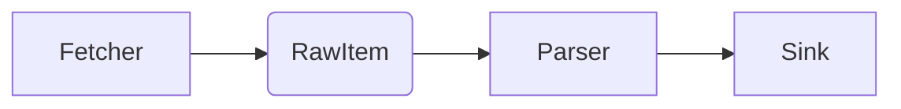

Below is a “mental roadmap” I’ve found useful when turning a pile of one-off scrapers + bots into a clean, extensible platform.  Skip anything that feels obvious; keep what resonates and adapt to your style.

---

## 1. Identify the stable axis of change

| Axis                | Relatively **stable**                             | Rapidly **changing**                                    |
| ------------------- | ------------------------------------------------- | ------------------------------------------------------- |
| Core behaviours     | *Fetch → Parse → Persist → Notify*                | The exact site/API, HTML quirks, payload formats        |
| Cross-cutting infra | Logging, retries, rate-limiting, auth, scheduling | Where a message goes (Discord, DB, file), schema tweaks |
| Deployment          | Docker image, CI job, k8s CronJob, systemd timer  | The number of instances, scrape frequency               |

Design the framework around the **stable axis** (behaviours & infra).  Everything that varies sits behind a thin, site-specific adapter.

---

## 2. Define canonical interfaces

```python
from abc import ABC, abstractmethod
from typing import Any, AsyncIterator, Dict, List
from pydantic import BaseModel

class RawItem(BaseModel):
    source: str          # e.g. "fi.se-short-sellers"
    payload: bytes       # keep raw for auditing
    fetched_at: float

class ParsedItem(BaseModel):
    topic: str           # e.g. "short_seller_update"
    content: Dict[str, Any]
    discovered_at: float

class Fetcher(ABC):
    @abstractmethod
    async def fetch(self) -> AsyncIterator[RawItem]:
        ...

class Parser(ABC):
    @abstractmethod
    async def parse(self, raw: RawItem) -> List[ParsedItem]:
        ...

class Sink(ABC):
    @abstractmethod
    async def handle(self, item: ParsedItem) -> None:
        ...
```

Everything you scrape must be expressible as:



No special cases.  If a service needs Selenium, it just implements its own `Fetcher`.  If a site’s data is already JSON, the `Parser` might be a no-op.

---

## 3. Orchestrator = glue code, not logic

Use an async task queue (Celery, Dramatiq, arq) **or** a simple `asyncio` scheduler (APScheduler) to:

1. Instantiate concrete `Fetcher/Parser/Sink` classes from config.
2. Run them on a schedule or trigger (webhook, Discord command).
3. Handle retries, exponential back-off, circuit-breaking.

Try to keep the orchestrator ignorant of the business domain.  Think of it like Kubernetes for scrapers: it launches/spec monitors, but doesn’t know what “short seller list” means.

---

## 4. Configuration over code

```yaml
services:
  fi_short_sellers:
    fetcher: FiODSFetcher            # class path importable
    parser: FiODSParser
    sinks: [DatabaseSink, DiscordSink]
    schedule: "0 */30 * * * *"       # crontab (every 30 min)
    env:
      ODS_BASE_URL: "https://..."
      DISCORD_CHANNEL: "stocks"
```

A new source = one YAML stanza + (usually) one new concrete class.  Redeploy, no code modification elsewhere.

---

## 5. Shared infrastructure modules

| Module         | Notes                                                                                   |
| -------------- | --------------------------------------------------------------------------------------- |
| **http.py**    | aiohttp wrapper with retry, proxy, auth, throttle, observability.                       |
| **ws.py**      | Common websocket manager (pings, reconnect, back-pressure).                             |
| **sel.py**     | Headless Playwright/Selenium helpers, inc. shadow-DOM utils.                            |
| **db.py**      | Thin DAL around SQLAlchemy/asyncpg; everything returns `ParsedItem` or domain entities. |
| **notify.py**  | Discord / Telegram / email wrappers implementing `Sink`.                                |
| **metrics.py** | Prometheus pushgateway or OTEL exporter.                                                |

All scrapers import from these; none re-implement them.

---

## 6. Avoid “God” models—compose

Example for Avanza live orderbook:

```python
class AvanzaFetcher(WebSocketFetcher):
    URI = "wss://..."
    async def subscribe(self):
        await self.ws.send_json({"cmd": "subscribe", "id": self.instrument_id})
```

```python
class AvanzaOrderbookParser(Parser):
    async def parse(self, raw: RawItem) -> List[ParsedItem]:
        data = orjson.loads(raw.payload)
        return [ParsedItem(
            topic="orderbook_tick",
            content={
                "bid": data["bids"][0],
                "ask": data["asks"][0],
                "instrument": data["id"],
            },
            discovered_at=raw.fetched_at
        )]
```

Neither class knows *where* the tick will be persisted or published.

---

## 8. Migration path for existing code

1. **Extract** the site-specific logic from each ad-hoc script into conforming `Fetcher`/`Parser` modules.
2. **Wrap** the legacy DB or Discord client in a `Sink` implementation.
3. **Gradually transplant**: Run new and old side-by-side; compare outputs until parity, then decommission.
