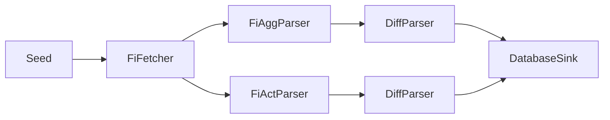

# Modular Scraping Platform - Technical Specification

Below is the technical specification for the modular scraping platform based on the implemented architecture. This document outlines the design principles and patterns used to create a clean, extensible framework.

---

## 1. Identify the stable axis of change

| Axis                | Relatively **stable**                             | Rapidly **changing**                                    |
| ------------------- | ------------------------------------------------- | ------------------------------------------------------- |
| Core behaviours     | *Transform Pipeline Processing*                    | The exact site/API, HTML quirks, payload formats        |
| Cross-cutting infra | Plugin discovery, async streaming, retry logic    | Where a message goes (Discord, DB, file), schema tweaks |
| Deployment          | Docker image, CI job, k8s CronJob, systemd timer  | The number of instances, scrape frequency               |

Design the framework around the **stable axis** (behaviours & infra). Everything that varies sits behind a thin, site-specific adapter.

---

## 2. Define canonical interfaces

The platform uses a **Transform-based architecture** where all components implement a universal interface:

```python
from abc import ABC, abstractmethod
from typing import Any, AsyncIterator, Dict, List
from datetime import datetime
from pydantic import BaseModel, Field

class RawItem(BaseModel):
    """Raw data fetched from a source."""
    source: str
    payload: bytes
    fetched_at: datetime = Field(default_factory=datetime.utcnow)

class ParsedItem(BaseModel):
    """Parsed and structured data."""
    topic: str           # e.g. "fi.short.aggregate"
    content: Dict[str, Any]
    discovered_at: datetime = Field(default_factory=datetime.utcnow)

class Event(BaseModel):
    """System events for logging and monitoring."""
    level: str  # INFO, WARNING, ERROR, etc.
    message: str
    source: str
    timestamp: datetime = Field(default_factory=datetime.utcnow)
    metadata: Dict[str, Any] = Field(default_factory=dict)

class Transform(ABC):
    """Universal transform interface for plugin pipeline stages.
    
    This is the core abstraction that enables plugin chaining.
    Any stage in a pipeline (fetcher, parser, sink) implements this interface.
    """
    
    @abstractmethod
    async def __call__(
        self, items: AsyncIterator[Any]
    ) -> AsyncIterator[Any]:
        """Transform an async iterator of items to another async iterator."""
        ...

# Legacy interfaces still supported for backward compatibility
class Fetcher(ABC):
    @property
    @abstractmethod
    def name(self) -> str:
        pass

    @abstractmethod
    async def fetch(self) -> AsyncIterator[RawItem]:
        ...

class Parser(ABC):
    @property
    @abstractmethod
    def name(self) -> str:
        pass

    @abstractmethod
    async def parse(self, item: RawItem) -> List[ParsedItem]:
        ...

class Sink(ABC):
    @property
    @abstractmethod
    def name(self) -> str:
        pass

    @abstractmethod
    async def handle(self, item: ParsedItem) -> None:
        ...
```

Everything you scrape must be expressible as a Transform chain:



**Key Innovation**: All pipeline stages implement both their legacy interface (Fetcher/Parser/Sink) AND the `Transform` interface, enabling seamless chaining without special cases.

---

## 3. Orchestrator = automatic plugin discovery + YAML config

The pipeline orchestrator provides:

1. **Automatic plugin discovery** from `plugins/` directory
2. **YAML-based configuration** without code changes
3. **Async context management** for resource cleanup
4. **Transform chaining** with backpressure-aware streaming

```python
# Plugin discovery happens automatically
from core.plugin_loader import refresh_registry, get

# Pipeline execution with context management
async def run_pipeline(cfg: Dict[str, Any]) -> None:
    instances: List[Transform] = []
    for entry in cfg["chain"]:
        cls = get(entry["class"])  # e.g., "fi_shortinterest.FiFetcher"
        kwargs = entry.get("kwargs", {})
        instances.append(cls(**kwargs))
    
    # Execute pipeline with automatic resource cleanup
    async with AsyncExitStack() as stack:
        for stage in instances:
            if hasattr(stage, "__aenter__"):
                await stack.enter_async_context(stage)
        
        # Chain stages and drain the pipeline
        await _drain(instances)
```

---

## 4. Configuration over code

```yaml
pipelines:
  fi_shortinterest_agg:
    chain:
      - class: fi_shortinterest.FiFetcher
        kwargs: {}
      - class: fi_shortinterest.FiAggParser
        kwargs: {}
      - class: fi_shortinterest.DiffParser
        kwargs:
          db_path: "fi_shortinterest.db"
      - class: fi_shortinterest.DatabaseSink
        kwargs:
          db_path: "fi_shortinterest.db"
```

A new source = one YAML stanza + dropping new plugin folder in `plugins/`. Zero code registration required.

---

## 5. Shared infrastructure modules

| Module         | Implementation                                                                          |
| -------------- | --------------------------------------------------------------------------------------- |
| **http.py**    | aiohttp wrapper with exponential backoff retry, session management, timeout handling   |
| **ws.py**      | WebSocket client with heartbeat, automatic reconnection, and backpressure management   |
| **sel.py**     | Playwright helpers for browser automation with shadow DOM support                      |
| **db.py**      | Async SQLite wrapper with migrations, connection pooling, WAL mode, and upsert support |
| **scheduler.py** | APScheduler wrapper for cron-based scheduling (future enhancement)                   |

All plugins import from these; none re-implement them.

---

## 6. Dual Interface Pattern - Composition over Inheritance

Example from FI Short Interest plugin:

```python
class FiFetcher(Fetcher, Transform):
    """Implements both legacy Fetcher interface and Transform interface."""
    
    async def fetch(self) -> AsyncIterator[RawItem]:
        # Legacy interface implementation
        # ... fetch logic
        
    async def __call__(self, items: AsyncIterator[Any]) -> AsyncIterator[RawItem]:
        """Transform interface: ignore input stream and yield fetched items."""
        async for item in items:
            async for raw_item in self.fetch():
                yield raw_item
            break  # Only process one input item to trigger fetching

class FiAggParser(Parser, Transform):
    """Implements both legacy Parser interface and Transform interface."""
    
    async def parse(self, item: RawItem) -> List[ParsedItem]:
        # Legacy interface implementation
        # ... parsing logic
        
    async def __call__(self, items: AsyncIterator[Any]) -> AsyncIterator[ParsedItem]:
        """Transform interface: parse RawItems into ParsedItems."""
        async for item in items:
            if isinstance(item, RawItem):
                parsed_items = await self.parse(item)
                for parsed in parsed_items:
                    yield parsed

class DatabaseSink(Sink, Transform):
    """Implements both legacy Sink interface and Transform interface."""
    
    async def handle(self, item: ParsedItem) -> None:
        # Legacy interface implementation
        # ... sink logic
        
    async def __call__(self, items: AsyncIterator[Any]) -> AsyncIterator[None]:
        """Transform interface: handle ParsedItems and pass them through."""
        async for item in items:
            if isinstance(item, ParsedItem):
                await self.handle(item)
            yield None  # Sinks complete the chain
```

This pattern allows legacy code to work while enabling the new Transform pipeline.

---

## 7. Advanced Features

### Change Detection with DiffParser

```python
class DiffParser(Parser, Transform):
    """Compares ParsedItems against database state and emits only changes."""
    
    async def parse(self, item: ParsedItem) -> List[ParsedItem]:
        """Compare against DB and return diff if changed."""
        if item.topic == "fi.short.aggregate":
            # Check database for previous values
            previous = await self.db.fetch_one(
                "SELECT position_percent FROM short_positions WHERE lei = ?",
                (item.content["lei"],)
            )
            
            current_percent = float(item.content["position_percent"])
            if not previous or abs(current_percent - previous["position_percent"]) > 0.001:
                # Emit diff event
                return [ParsedItem(
                    topic="fi.short.aggregate.diff",
                    content={**item.content, "old_pct": previous["position_percent"] if previous else 0.0},
                    discovered_at=item.discovered_at
                )]
        return []
```

### Automatic Resource Management

```python
class DatabaseSink(Sink, Transform):
    async def __aenter__(self):
        """Async context manager entry."""
        await self.db.connect()
        return self

    async def __aexit__(self, exc_type, exc_val, exc_tb):
        """Async context manager exit."""
        await self.db.close()
```

### Plugin Auto-Discovery

```python
# Scans plugins/ directory automatically
def refresh_registry() -> None:
    """Scan all Python files in plugins/ and register Transform subclasses."""
    for py_file in PLUGIN_DIR.rglob("*.py"):
        if py_file.name.startswith("_"):
            continue
            
        mod = _load_module(py_file)
        
        # Find all Transform subclasses
        for name, obj in inspect.getmembers(mod, inspect.isclass):
            if (issubclass(obj, Transform) and 
                obj is not Transform and 
                obj.__module__ == mod.__name__):
                
                key = f"{py_file.parent.name}.{obj.__name__}"
                _REGISTRY[key] = obj
```

---

## 8. Migration path for existing code

1. **Implement dual interfaces**: Make existing classes inherit from both legacy interface and `Transform`
2. **Add `__call__` method**: Implement the Transform interface as a wrapper around legacy methods
3. **Add plugin configuration**: Drop plugin folder in `plugins/` directory with YAML config
4. **Gradual migration**: Run new and old systems side-by-side until parity achieved
5. **Resource cleanup**: Add async context manager support (`__aenter__`/`__aexit__`) for proper cleanup

The architecture supports both patterns simultaneously, enabling gradual migration without breaking changes.

---

## 9. Real-world Example: FI Short Interest Pipeline

**File Structure:**
```
plugins/fi_shortinterest/
├── __init__.py           # Plugin registration
├── fetcher.py           # FiFetcher class
├── parser.py            # FiAggParser, FiActParser classes  
├── diff_parser.py       # DiffParser class
└── sinks.py             # DatabaseSink class
```

**Pipeline Configuration:**
```yaml
pipelines:
  fi_shortinterest_agg:
    chain:
      - class: fi_shortinterest.FiFetcher      # Fetches ODS files from FI
      - class: fi_shortinterest.FiAggParser    # Parses aggregate data
      - class: fi_shortinterest.DiffParser     # Detects changes vs DB
      - class: fi_shortinterest.DatabaseSink   # Persists to SQLite
```

**Execution Flow:**
1. `FiFetcher` polls FI website for new timestamp, downloads ODS files if changed
2. `FiAggParser` converts ODS bytes to structured `ParsedItem` objects
3. `DiffParser` compares against database, emits diff events only on changes
4. `DatabaseSink` upserts data to SQLite with automatic schema management

**Zero Registration Required**: Drop the plugin folder, restart the system, and it's automatically discovered and available for use in YAML configuration.
